# Happy Making!
 You can follow the steps to build and modify your own tactile actuator. Keep in mind that SMA version (this project) is designed to be as simple and lightweight as possible, even at the expense of stimulation force, footprint or total linear motion. However, this guide and the [user guide](/docs/user-manual.md) should provide you with all you need to know in case you would like to [optimize the design](#modifying-the-design).

We really appreciate your interest in Tact-io and we hope you have fun during the building and experimenting process. [Let us know](#get-in-touch-with-the-community) if you make something cool!

# Tools
You will need to have basic electronics or maker skills (like using a soldering iron) to build the hardware. Please be advised that you could burn, cut, or poke yourself if you are not careful or skillful enough.   
 Because the SMA wire we are using is about the thickness of a human hair, you might need a little practice before effectively tying it down. We recommend practicing with a thin thread or some hair beforehand. Alternatively, you can choose a thicker SMA wire, which will be easier to tie, provide more force, but require more current to activate. 

1. Soldering iron and solder 
1. Utility (exacto) knife
1. Pliers
1. Hand drill (drill bits = x Diameter)
1. Glue gun
1. (_optional_) multimeter.
1. (_optional_) 3d printer, if you are printing your own case.

# Materials
Besides the SMA wire (which can be easily bought online), this project is designed using very basic electronics components and everyday items (guitar string, wood sticks, paperclip and spring). This choice of materials is deliberate. By using easily available (and affordable) components we make it easier for everyone to start making and experimenting. This also leaves plenty of room for improvement and optimization, so feel free to [modify the design](#modifying-the-design) to fit your needs!

1. Muscle wire  ( Dynalloy)
2. Pre Perforated prototype pcb. 
3. wrapping wire (anything around 28 AWG should work, is just to solder the support in place)
4. Thicker electric wire ().
5. resistor (or pwm circuit)
6. 0.4mm guitar string metal (around 0.16 in) (specially tempered tin plated high carbon steel or high carbon steel) … el cometa Si 2nda. acero plateado no.501
7. wood stick paleta
8. diameter 4mm wood toothpick
9. paper clip
10. compression spring. (details in [Step 1.3](#step-1-preparation))
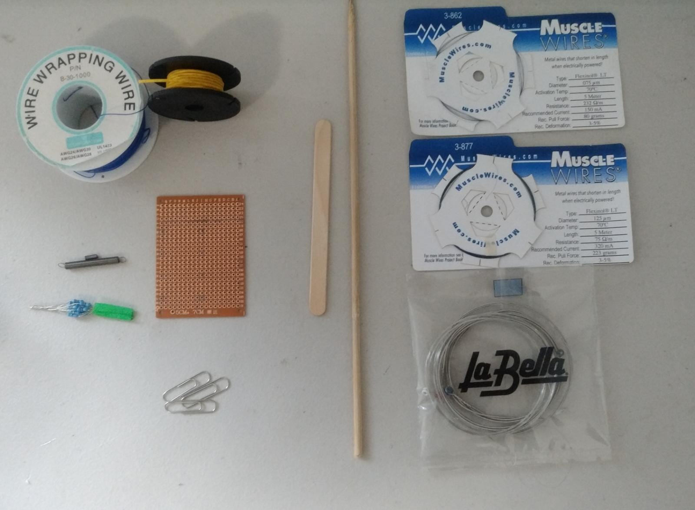
# Build instructions
## Step 1: Preparation
1. Mark layout in **board** and **wood sticks**, then drill holes.
   1. Mark the layout on the preperforated PCB board and cut it to size. 
   
   
    
   1. Mark the layout on the wood stick (popsicle stick), cut it to size and drill the marked holes (1mm diameter for holes marked `1` and 0.9mm diameter for holes marked `2` and `3`). This forms the _lever_ of the mechanism. 
   
   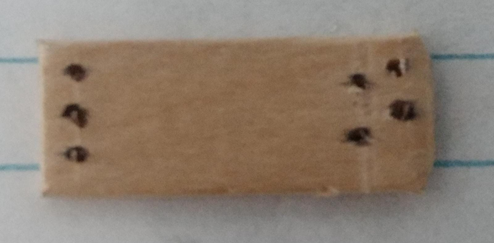
   1. Mark the layout in the wood stick (6mm diameter toothpick), cut it to size, drill the marked holes and use the exacto knife to carve the marked 'groove'. This forms the _SMA wire guide_.
   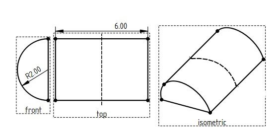
   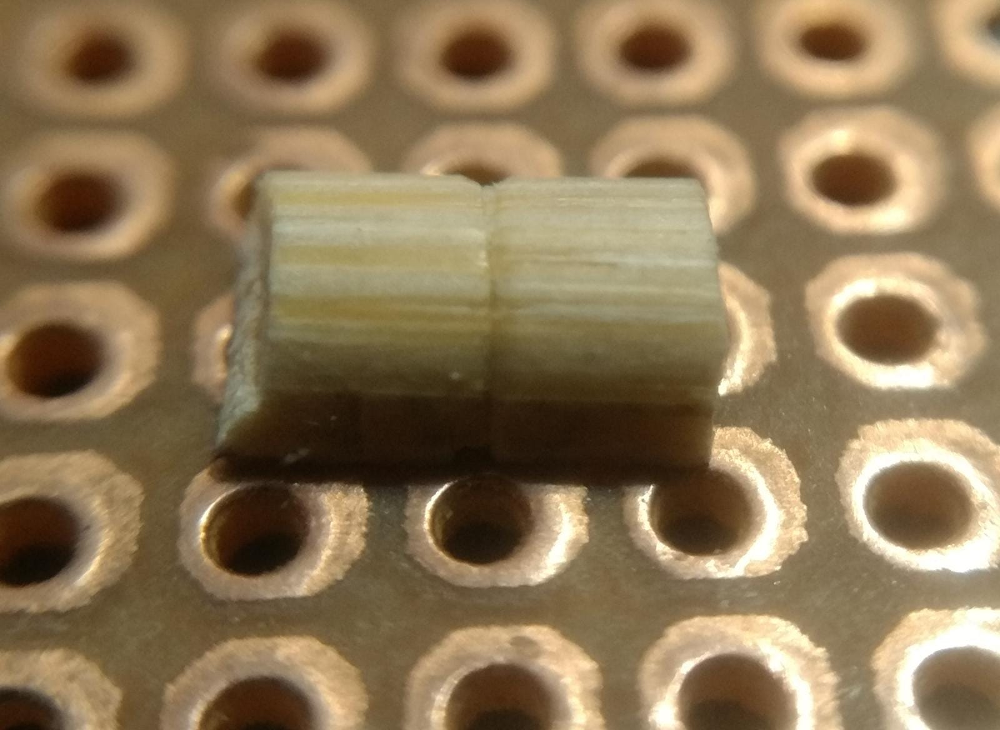
2. Cut the **paperclip** to size and fold it according to the picture. This is the _pin_ that presses against the skin. 

3. Prepare the **spring**.  
Use a spring that has enough force to return the lever to its resting postion. In our case, that would be 32g, according to our [manufacturer's specifications](https://www.dynalloy.com/pdfs/TCF1140.pdf). We source our compression spring at our local [electronics store](https://addison-electronique.com/en/products/hardware-tools/tools/extension-spring-5-75-mm-x-445-mm/), but if you can't find it, you can also buy online a ball point pen spring for a few cents, or you can make your own following the instructions below (step 1.3.3).

   1. Cut the spring to size (15mm). 
   2. _Alternatively_, you can stretch (deform) a tension spring to obtain a compression spring. 
   3. _If you prefer_, you can build your own spring using steel wire (you can see this [youtube video](https://www.youtube.com/watch?v=ubQqYq5vmnc&ab_channel=TheWeevilGenius) for a comprenhesive guide to making small springs with music wire):
      1. Securely hold the steel wire around the base of a screw. 
      2. Carefully wrap the steel wire around the screw very tightly.
      3. Bend your spring to shape, and cut to size.
1. Strip and cut 10mm of the **thicker electric wire**. This will be the _tiying post_ for the SMA wire.   

## Step 2: Assembly 
1. Assemble the **lever**.
   1. Strip 15mm from the end of the **wrapping wire** and loop it around the holes marked `2` in the lever diagram twice and twist it on the top side. Don't loop it to tight, leave about 1 mm clearance to tie the SMA wire to the loop. Add a drop of solder to the wrapping wire on top of the board to secure the loops together. Cut the wrapping wire at 15cm after the loop. 
   
   1. Tie the **SMA wire** to the loop of wrapping wire that we just created with two simple knots, as shown in the diagram. Cut the wire at 5cm after the knot. (If you have dificulties tiying it down, you could leave extra lenght to facilitate the process). You can look at this [online animated knot tutorial](https://www.animatedknots.com/overhand-knot) for more inforamtion. 
   
   1. Insert the **steel wire** in the middle hole marked `3` from the bottom and wrap it around the other `3` holes as shown in the picture. Cut the wire leaving about 10mm from the bottom end of the lever.
   
   2. Insert the _pin_ from the top of the board as shown in the diagram, do not secure it in place yet. 
   
2. Assemble the **board**.
   1. Align the carved groove of the _SMA wire guide_ with the marked perforation in the board. Glue it in place with the hot glue. 
   
   1. Slighly bend the _tying post_ and insert it in the marked holes as shown in the picture. Insert an stripped wrapping wire and solder them together in place.
   

3. **Final** assembly.
   1. Align the _lever_ and _board_ by inserting the _pin_ and _steel wire_ in their respective board holes, marked as clip and music wire in the layout board.  
   
   1. Fold the _steel wire_ and insert it in the marked board hole, bend it again to insert it into the next hole. Fill both holes with solder, make sure to heat the _steel wire_ enough so that solder flows properly.
   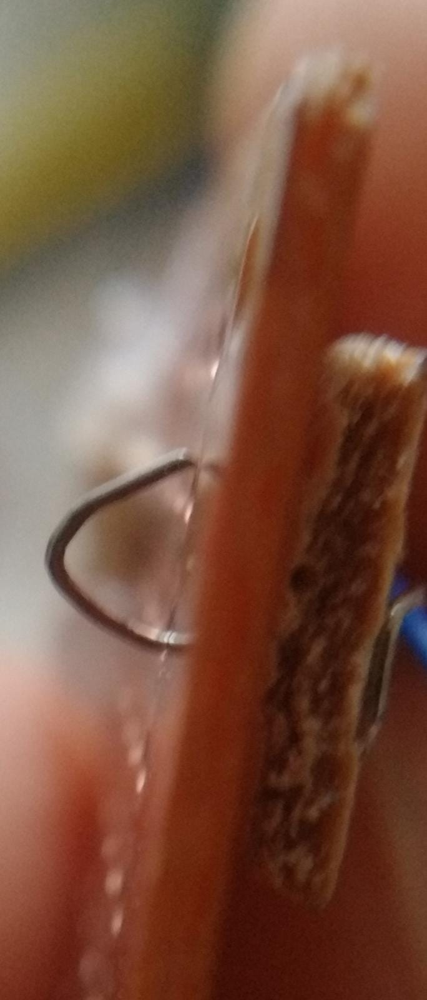
   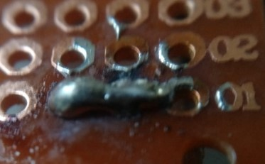

   2. Raise the _pin_ enough to place the _spring_ between the _board_ and the _lever_, replace the _pin_ on the marked hole and secure in place by folding the short side underneath the _lever_.   
   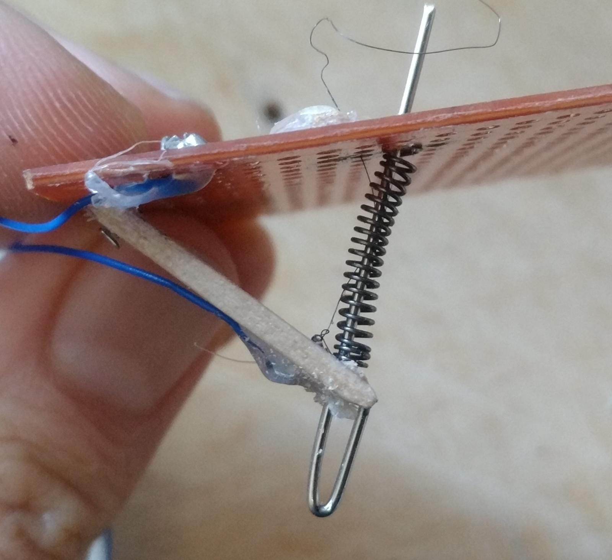
   
   3. _SMA wire_:
      1. Insert the loose end of the _SMA wire_ in the marked hole and guide it through the _SMA wire guide_ and insert it on the _tying post_. 
      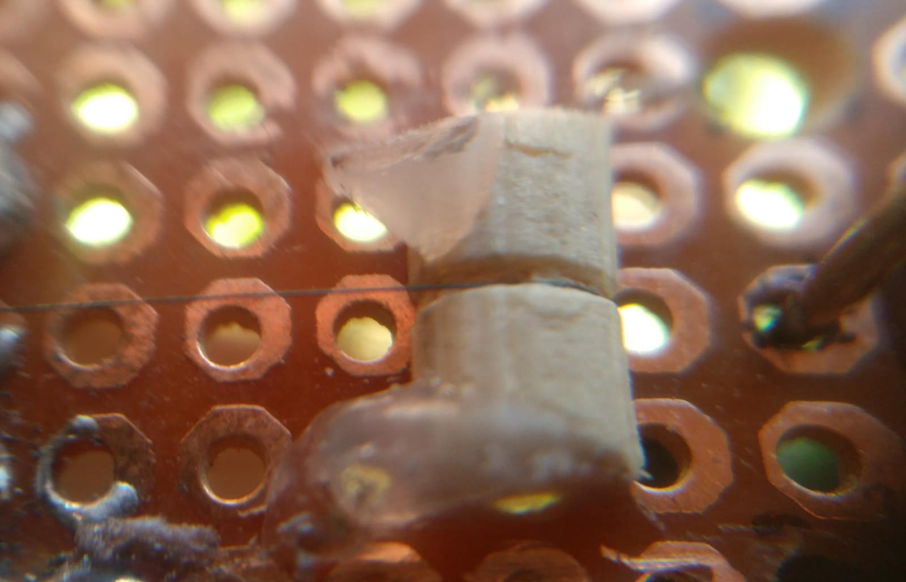 
      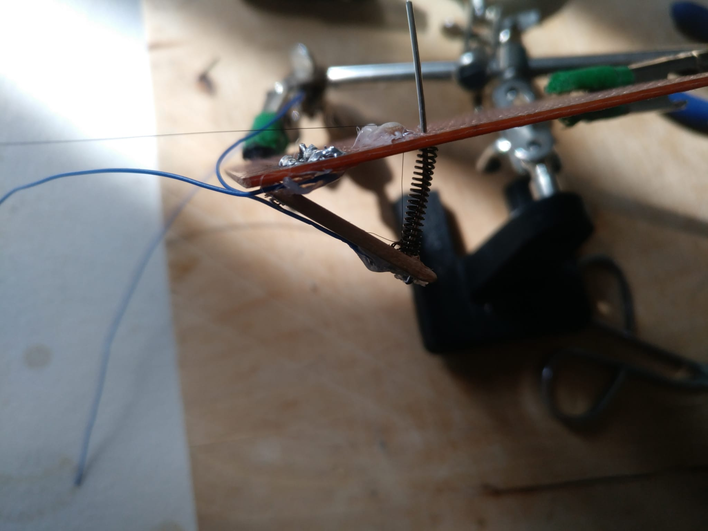
      1. To properly tension the wire, slightly press the _lever_. The _lever_ should be about 10mm from the _board_. 
      
      1. With the _lever_ slighlty pressed, pull the _SMA wire_ and tie a simple knot around the _tying post_. Don't let go of the _lever_ yet, or else the knot might slip and become loose. 
      2. After the first simple knot, tie another simple knot, to secure the knot and prevent it from slipping. You can now release the _lever_ to properly tension the _SMA wire_.  

      
      >Note that the SMA wire **MUST be tensioned correctly** for the mechanism to work properly. If the SMA wire is too loose, the contraction will only serve to tighten it, instead of pulling the lever. If your pin is not working as intended, try untiying/cutting the wire and trying tieing it more tighly again.  

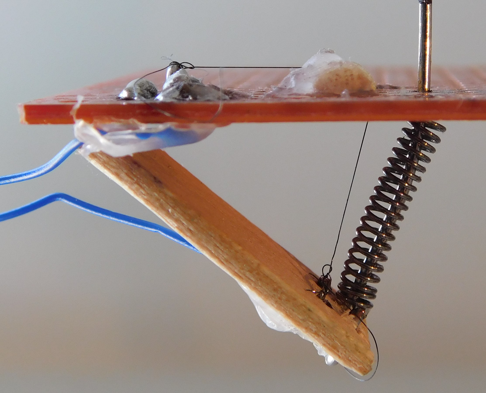
## Step 3: Power
When current is applied to the _SMA wire_, [it heats up and constricts](/docs/README.md#how-tact-io-works) (changing its crystaline structure). To achieve this effect you can provide at least the manufacturer's recommended current for the _SMA wire_ thickness you've chosen. 
If you've used the same thickness as this guide (75um diameter), and tension the _SMA wire_ properly, its enough to add two 11 Ohms and 1/2 Watt resistors in series with the tact-io, and connect them to a 5v power supply. If you have a multimeter, you can measure the current and make sure is at least the recommended current. If you provide too much current, you might damage the _SMA wire_, in which case, you would need to remove the damaged wire and tyie a new one by follwing the [assembly steps](#step-2-assembly) 2.1.ii and 2.3.iv .
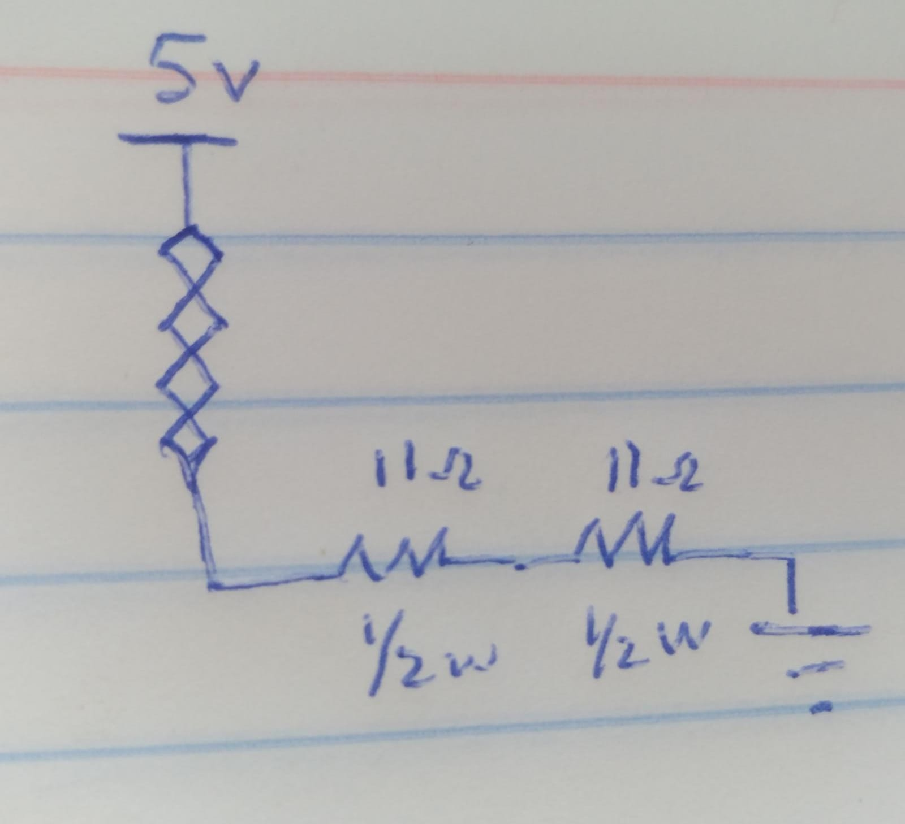

### Calculating the resistor 
Alternatively, you can calculate the resistor value for your specific circuit by using ohms law. Rt= V/I. 
Total circuit resistance (the _SMA wire_ resistance + the external resistance) is equal to the voltage that you are using to power the circuit, divided by the recommended current provided by the manufacturer of your _SMA wire_, according to its thickness.

For example, if you have a xum diameter _SMA wire_ with a recommended current of i A, powered by v Volts. The calculation is as follows:
Rt = v V/ i A = o Ohms. 

To obtain the value for the external resistor, you need measure the resistance of your _SMA wire_ and substract it to the total resistance value you calculated earlier. 

To calculate the power that the resistance will need to dissipate, you simply need to multiply the resistor value times the square of your manufacturer's recommended current P= R x I x I. 
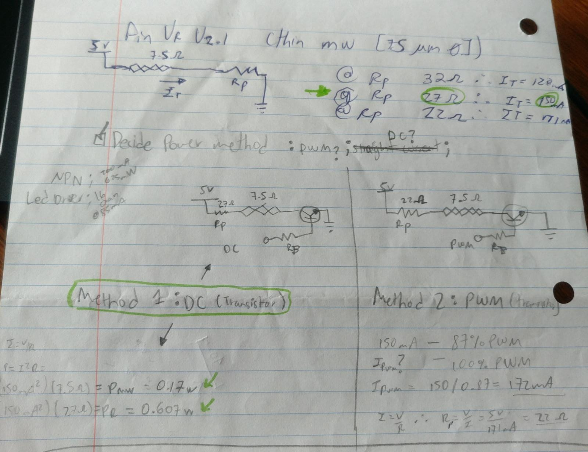

### PWM
Instead of using a resistor to limit the power that the muscle wire dissipates, you can use a PWM circuit. We've included the code for an arduino PWM circuit, configured at around 87% duty cycle, which works well for our design. If you have a different design, you will have to experiment with the duty cycle to see what duty cycle properly activates your Tact-io and _feels right_ on your skin. 

Here is a diagram of such a circuit. 
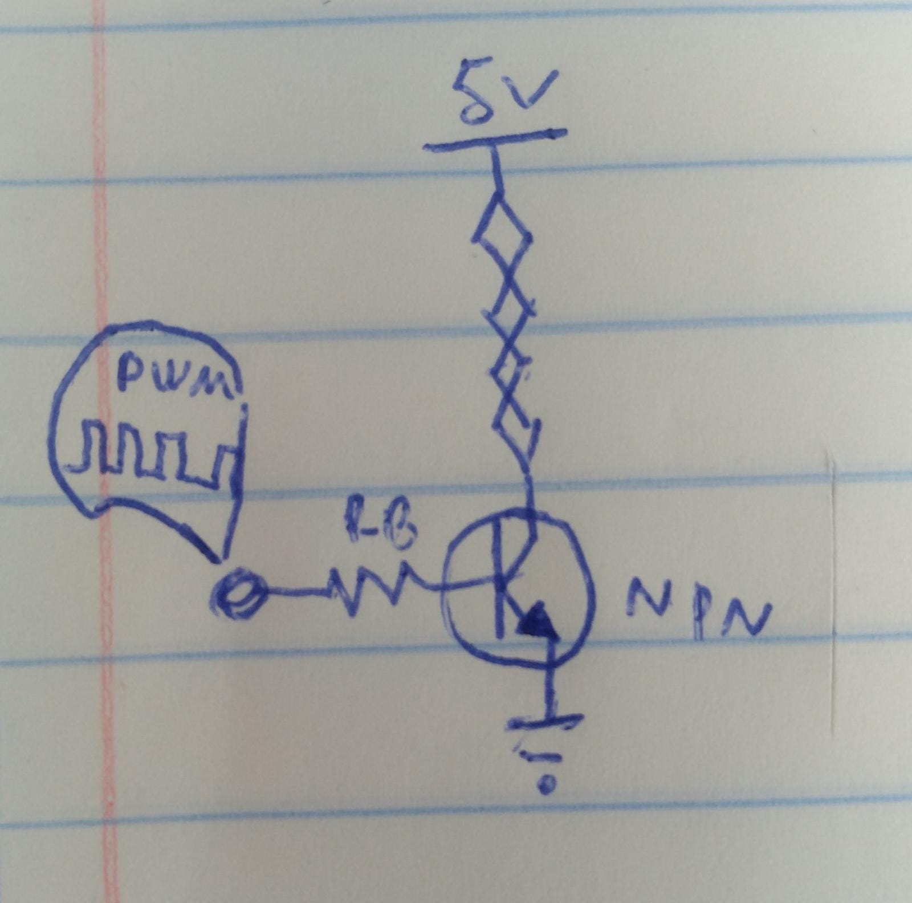

## Step 4: Case (_Optional_)
You will probably want to hide the actuation mechanism of the Tact-io, so the users only come in contact with the tip of the _pin_. Keeping in touch with the simplistic spirit of this project, you can build an enclosure by gluing wood sticks in place, drilling a hole for the end of the _pin_.

### 3d printed case
We have also included the [FreeCAD](https://www.freecadweb.org/) parametric model ([lid](/docs/source/case/topLidCase.FCStd),[case](/docs/source/case/botomCase.FCStd)) for a 3d printed enclosure. 

>This step opens many possibilities. We encourage creative makers to experiment with the case, perhaps you could make something to attach your Tact-io to the fingertip, or to the wrist, or to the side of your arms. 

# Modifying the design 
If you already read the Tact-io [user manual](/docs/user-manual.md) and are ready to adapt the design to your project needs, we recommend you build a few Tact-io pins first. This process will give you a feeling of the operation of the mechanism and the force and displacement generated by the of the contraction of the SMA wire. You can find more information about the particular SMA wire we are using in this project in [DYNALLOY's Technical characteristics of FLEXINOL Actuator Wires](https://www.dynalloy.com/pdfs/TCF1140.pdf), which goes into more details about the design of SMA-actuated mechanisms including reducing the [size](#does-your-application-need-a-smaller-actuator) and increasing the [force](#does-your-application-need-more-force) and [displacement](#does-your-application-need-more-displacement) of the mechanism.  

## Does your application need more force?  
a) Use a thicker SMA wire. Please consider that a thicker muscle wire will require more current to activate, and generally thicker wires activate more slowly, and might require a stronger spring to produce the recommended return force. Check with the manufacturer of your SMA wire for these details. _Remember to calculate the proper [external resistor](#calculating-the-resistor) or [PWM](#pwm) duty cycle for your SMA wire_.

b) Add a second muscle wire in parallel to the first one. This is a good option if you dont want to increase the time it takes to activate the pin. In this case, be sure to provide each SMA wire with at least the manufacturer's recommended current.  

## Does your application need more displacement?  
There are several ways to configure the mechanism to increase the displacement provided by the contraction of the SMA wire (3-5% of the SMA wire lenght).
>Here are some other arrangements you can do: bow, triangle, etc, etc.  

Be sure to measure the resistance of your Tact-io design to [power](#step-3-power) it accordingly. 
  
## Does your application need a smaller actuator?  
We chose the simplest layout, as opose to optimal one. However, feel free to experiment with the arrangement of the components, with the possible SMA wire configurations mentioned [above](#does-your-application-need-more-displacement), with the materials used and the shape, material and size of the [enclosure](#step-4-case-optional).
Before powering your own Tact-io design, _remember to calculate the proper [external resistor](#calculating-the-resistor) or [PWM](#pwm) duty cycle for your SMA wire_.

## Get in touch with the community
If you want to share your modifications to the hardware, be sure to follow the [contribuitors guideliness](/docs/contribuiting.md). 

If you need help building or adapting Tact-io to your needs, or would like to share a picture or opinion of your Tact-io build or modification, please [get in touch](/docs/README.md#get-in-touch). 